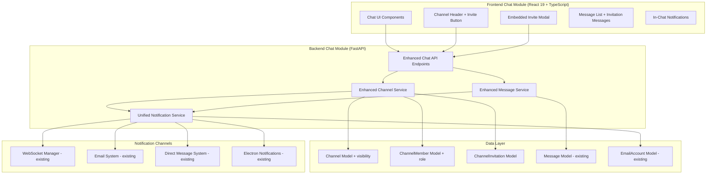
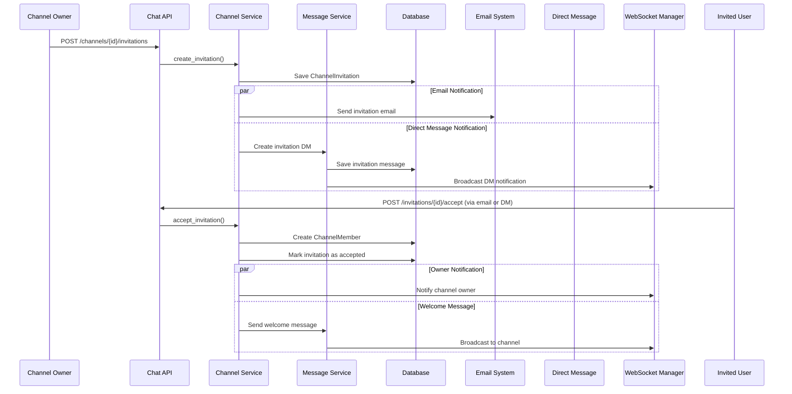

# Design Document: Private Channels with Invitations

## Overview

This design implements private channel functionality with invitation system as an extension to the existing chat module. The solution extends the existing Channel and ChannelMember models with visibility control and role-based permissions, introduces a new ChannelInvitation model for invitation management, and integrates with existing email and WebSocket notification systems.

**Key Design Principles:**
- **Unified Chat Module**: All invitation functionality is integrated into the existing chat module, not as a separate module
- **Dual Notification Channels**: Invitations are sent via both email and direct messages in the chat system
- **Embedded UI Components**: Invitation modals and management interfaces are embedded within existing chat components
- **Existing Infrastructure Reuse**: Leverages existing WebSocket manager, EmailAccount system, and chat message infrastructure

The design follows the modular monolith architecture with FastAPI backend and React frontend, extending the existing `app/modules/chat/` structure.

## Architecture

### High-Level Architecture



### Dual Notification Flow for Invitations



## Components and Interfaces

### Backend Components

#### 1. Enhanced Channel Model

```python
# app/modules/chat/models.py - Enhanced Channel class
class Channel(Base):
    __tablename__ = "channels"
    
    # Existing fields...
    id: Mapped[int] = mapped_column(primary_key=True, index=True)
    name: Mapped[str] = mapped_column(String(100), nullable=False)
    description: Mapped[str] = mapped_column(Text, nullable=True)
    created_by: Mapped[int] = mapped_column(ForeignKey("users.id"), nullable=False)
    is_direct: Mapped[bool] = mapped_column(default=False, nullable=False, index=True)
    
    # New field for private channels
    visibility: Mapped[str] = mapped_column(
        String(20), 
        default="public", 
        nullable=False, 
        index=True
    )  # Values: "public", "private"
    
    created_at: Mapped[datetime] = mapped_column(DateTime, default=lambda: datetime.now(timezone.utc), nullable=False)
    updated_at: Mapped[datetime] = mapped_column(
        DateTime, 
        default=lambda: datetime.now(timezone.utc), 
        onupdate=lambda: datetime.now(timezone.utc),
        nullable=False
    )
```

#### 2. Enhanced ChannelMember Model

```python
# app/modules/chat/models.py - Enhanced ChannelMember class
class ChannelMember(Base):
    __tablename__ = "channel_members"
    
    # Existing fields...
    id: Mapped[int] = mapped_column(primary_key=True, index=True)
    channel_id: Mapped[int] = mapped_column(ForeignKey("channels.id"), nullable=False, index=True)
    user_id: Mapped[int] = mapped_column(ForeignKey("users.id"), nullable=False, index=True)
    joined_at: Mapped[datetime] = mapped_column(DateTime, default=lambda: datetime.now(timezone.utc), nullable=False)
    last_read_message_id: Mapped[Optional[int]] = mapped_column(Integer, nullable=True)
    is_pinned: Mapped[bool] = mapped_column(default=False, nullable=False, index=True)
    mute_until: Mapped[Optional[datetime]] = mapped_column(DateTime, nullable=True)
    
    # New field for role-based permissions
    role: Mapped[str] = mapped_column(
        String(20), 
        default="member", 
        nullable=False, 
        index=True
    )  # Values: "owner", "admin", "moderator", "member"

    __table_args__ = (
        UniqueConstraint("channel_id", "user_id", name="uq_channel_user"),
    )
```

#### 3. Enhanced Message Model (Support for Invitation Messages)

```python
# app/modules/chat/models.py - Enhanced Message class
class Message(Base):
    __tablename__ = "messages"
    
    # Existing fields...
    id: Mapped[int] = mapped_column(primary_key=True, index=True)
    channel_id: Mapped[int] = mapped_column(ForeignKey("channels.id"), nullable=False, index=True)
    user_id: Mapped[int] = mapped_column(ForeignKey("users.id"), nullable=False, index=True)
    document_id: Mapped[Optional[int]] = mapped_column(ForeignKey("documents.id"), nullable=True, index=True)
    parent_id: Mapped[Optional[int]] = mapped_column(ForeignKey("messages.id"), nullable=True, index=True)
    content: Mapped[str] = mapped_column(Text, nullable=False)
    created_at: Mapped[datetime] = mapped_column(DateTime, default=lambda: datetime.now(timezone.utc), nullable=False, index=True)
    updated_at: Mapped[Optional[datetime]] = mapped_column(DateTime, nullable=True, onupdate=lambda: datetime.now(timezone.utc))
    
    # New field for message types (including invitations)
    message_type: Mapped[str] = mapped_column(
        String(20), 
        default="text", 
        nullable=False, 
        index=True
    )  # Values: "text", "invitation", "system", "file", etc.
    
    # New field for invitation reference
    invitation_id: Mapped[Optional[int]] = mapped_column(
        ForeignKey("channel_invitations.id"), 
        nullable=True, 
        index=True
    )
    
    # Existing relationships...
    document = relationship("Document")
    user = relationship("app.modules.auth.models.User")
    reactions = relationship("MessageReaction", cascade="all, delete-orphan")
    replies = relationship("Message", backref=backref("parent", remote_side=[id]), cascade="all, delete-orphan")
    
    # New relationship for invitation messages
    invitation = relationship("ChannelInvitation", backref="messages")
```

#### 4. New ChannelInvitation Model

```python
# app/modules/chat/models.py - New ChannelInvitation class
class ChannelInvitation(Base):
    __tablename__ = "channel_invitations"
    
    id: Mapped[int] = mapped_column(primary_key=True, index=True)
    channel_id: Mapped[int] = mapped_column(ForeignKey("channels.id"), nullable=False, index=True)
    invited_by: Mapped[int] = mapped_column(ForeignKey("users.id"), nullable=False, index=True)
    email: Mapped[str] = mapped_column(String(255), nullable=False, index=True)
    role: Mapped[str] = mapped_column(String(20), default="member", nullable=False)
    token: Mapped[str] = mapped_column(String(64), unique=True, nullable=False, index=True)
    status: Mapped[str] = mapped_column(String(20), default="pending", nullable=False, index=True)
    expires_at: Mapped[datetime] = mapped_column(DateTime, nullable=False, index=True)
    created_at: Mapped[datetime] = mapped_column(DateTime, default=lambda: datetime.now(timezone.utc), nullable=False)
    responded_at: Mapped[Optional[datetime]] = mapped_column(DateTime, nullable=True)
    
    # Relationships
    channel = relationship("Channel")
    inviter = relationship("User", foreign_keys=[invited_by])

    __table_args__ = (
        UniqueConstraint("channel_id", "email", name="uq_channel_email_invitation"),
    )
```

#### 4. Enhanced Invitation Service (Integrated into Chat Module)

```python
# app/modules/chat/invitation_service.py - New service within chat module
class InvitationService:
    @staticmethod
    async def create_invitation(
        db: AsyncSession,
        channel_id: int,
        inviter_id: int,
        email: str,
        role: str = "member"
    ) -> ChannelInvitation:
        """Create and send a channel invitation via email and direct message"""
        
        # Create invitation record
        invitation = await InvitationService._create_invitation_record(
            db, channel_id, inviter_id, email, role
        )
        
        # Send email notification
        await InvitationService._send_email_invitation(db, invitation)
        
        # Send direct message notification (if user exists in system)
        await InvitationService._send_dm_invitation(db, invitation)
        
        return invitation
        
    @staticmethod
    async def _send_dm_invitation(
        db: AsyncSession,
        invitation: ChannelInvitation
    ) -> Optional[Message]:
        """Send invitation as direct message if user exists in system"""
        from app.modules.chat.service import MessageService
        
        # Check if invited email belongs to existing user
        user = await get_user_by_email(db, invitation.email)
        if not user:
            return None
            
        # Create direct message with invitation
        invitation_message = await MessageService.create_invitation_message(
            db=db,
            inviter_id=invitation.invited_by,
            invitee_id=user.id,
            invitation_id=invitation.id
        )
        
        return invitation_message
        
    @staticmethod
    async def accept_invitation_from_dm(
        db: AsyncSession,
        invitation_id: int,
        user_id: int,
        message_id: int
    ) -> ChannelMember:
        """Accept invitation from direct message interface"""
        
        # Accept the invitation
        member = await InvitationService.accept_invitation(db, invitation_id, user_id)
        
        # Update the invitation message to show accepted status
        await MessageService.update_invitation_message_status(
            db, message_id, "accepted"
        )
        
        # Send welcome message to channel
        await MessageService.send_welcome_message(db, member.channel_id, user_id)
        
        return member
        
    @staticmethod
    async def accept_invitation(
        db: AsyncSession,
        invitation_id: int,
        user_id: int
    ) -> ChannelMember:
        """Accept an invitation and join the channel"""
        
    @staticmethod
    async def decline_invitation(
        db: AsyncSession,
        invitation_id: int,
        user_id: int
    ) -> ChannelInvitation:
        """Decline an invitation"""
        
    @staticmethod
    async def cancel_invitation(
        db: AsyncSession,
        invitation_id: int,
        canceller_id: int
    ) -> ChannelInvitation:
        """Cancel a pending invitation (owner only)"""
        
    @staticmethod
    async def get_pending_invitations_for_user(
        db: AsyncSession,
        email: str
    ) -> List[ChannelInvitation]:
        """Get all pending invitations for a user's email"""
        
    @staticmethod
    async def get_channel_invitations(
        db: AsyncSession,
        channel_id: int,
        requester_id: int
    ) -> List[ChannelInvitation]:
        """Get all invitations for a channel (owner only)"""
```

#### 5. Enhanced Message Service (Extended for Invitation Messages)

```python
# app/modules/chat/service.py - Enhanced MessageService
class MessageService:
    @staticmethod
    async def create_invitation_message(
        db: AsyncSession,
        inviter_id: int,
        invitee_id: int,
        invitation_id: int
    ) -> Message:
        """Create a special invitation message in direct messages"""
        
        # Get or create direct message channel between inviter and invitee
        dm_channel = await ChannelService.get_or_create_direct_channel(
            db, inviter_id, invitee_id
        )
        
        # Create invitation message with special content type
        invitation_message = Message(
            channel_id=dm_channel.id,
            user_id=inviter_id,
            content=f"invitation:{invitation_id}",  # Special format for invitation messages
            message_type="invitation"  # New field to distinguish message types
        )
        
        db.add(invitation_message)
        await db.commit()
        await db.refresh(invitation_message)
        
        # Broadcast via WebSocket
        await websocket_manager.broadcast_to_channel(
            dm_channel.id,
            {
                "type": "invitation_message",
                "message": invitation_message,
                "invitation_id": invitation_id
            }
        )
        
        return invitation_message
        
    @staticmethod
    async def update_invitation_message_status(
        db: AsyncSession,
        message_id: int,
        status: str
    ) -> Message:
        """Update invitation message to reflect response status"""
        
    @staticmethod
    async def send_welcome_message(
        db: AsyncSession,
        channel_id: int,
        new_member_id: int
    ) -> Message:
        """Send automated welcome message when user joins channel"""
```

#### 5. Enhanced Channel Service

```python
# app/modules/chat/service.py - Enhanced methods
class ChannelService:
    @staticmethod
    async def get_user_channels(
        db: AsyncSession,
        user_id: int
    ) -> List[Channel]:
        """Get channels visible to user (public + private where member)"""
        
    @staticmethod
    async def can_user_access_channel(
        db: AsyncSession,
        channel_id: int,
        user_id: int
    ) -> bool:
        """Check if user can access a channel based on visibility and membership"""
        
    @staticmethod
    async def get_user_role_in_channel(
        db: AsyncSession,
        channel_id: int,
        user_id: int
    ) -> Optional[str]:
        """Get user's role in a channel"""
        
    @staticmethod
    async def can_user_invite_to_channel(
        db: AsyncSession,
        channel_id: int,
        user_id: int
    ) -> bool:
        """Check if user can send invitations (owner only)"""
```

### API Endpoints (Integrated into Chat Router)

#### 1. Enhanced Chat Router with Invitation Endpoints

```python
# app/modules/chat/router.py - Enhanced existing router

@router.post("/channels/{channel_id}/invitations", response_model=InvitationResponse)
async def create_invitation(
    channel_id: int,
    invitation_data: InvitationCreate,
    current_user: User = Depends(get_current_user),
    db: AsyncSession = Depends(get_db)
):
    """Create a new channel invitation (owner only) - sends both email and DM"""
    
    # Validate user is channel owner
    user_role = await ChannelService.get_user_role_in_channel(db, channel_id, current_user.id)
    if user_role != "owner":
        raise HTTPException(status_code=403, detail="Only channel owners can create invitations")
    
    # Create invitation with dual notification
    invitation = await InvitationService.create_invitation(
        db=db,
        channel_id=channel_id,
        inviter_id=current_user.id,
        email=invitation_data.email,
        role=invitation_data.role
    )
    
    return invitation

@router.get("/invitations/pending", response_model=List[InvitationResponse])
async def get_pending_invitations(
    current_user: User = Depends(get_current_user),
    db: AsyncSession = Depends(get_db)
):
    """Get pending invitations for current user (by email)"""
    
    user_email = current_user.email_account.email_address if current_user.email_account else current_user.email
    invitations = await InvitationService.get_pending_invitations_for_user(db, user_email)
    return invitations

@router.post("/invitations/{invitation_id}/accept")
async def accept_invitation(
    invitation_id: int,
    current_user: User = Depends(get_current_user),
    db: AsyncSession = Depends(get_db)
):
    """Accept a channel invitation"""
    
    member = await InvitationService.accept_invitation(db, invitation_id, current_user.id)
    
    # Broadcast welcome message to channel
    await websocket_manager.broadcast_to_channel(
        member.channel_id,
        {
            "type": "user_joined",
            "user": current_user,
            "channel_id": member.channel_id
        }
    )
    
    return {"status": "accepted", "channel_id": member.channel_id}

@router.post("/invitations/{invitation_id}/accept-from-dm")
async def accept_invitation_from_dm(
    invitation_id: int,
    message_id: int,
    current_user: User = Depends(get_current_user),
    db: AsyncSession = Depends(get_db)
):
    """Accept invitation from direct message interface"""
    
    member = await InvitationService.accept_invitation_from_dm(
        db, invitation_id, current_user.id, message_id
    )
    
    return {"status": "accepted", "channel_id": member.channel_id}

@router.post("/invitations/{invitation_id}/decline")
async def decline_invitation(
    invitation_id: int,
    current_user: User = Depends(get_current_user),
    db: AsyncSession = Depends(get_db)
):
    """Decline a channel invitation"""
    
    invitation = await InvitationService.decline_invitation(db, invitation_id, current_user.id)
    return {"status": "declined"}

@router.delete("/channels/{channel_id}/invitations/{invitation_id}")
async def cancel_invitation(
    channel_id: int,
    invitation_id: int,
    current_user: User = Depends(get_current_user),
    db: AsyncSession = Depends(get_db)
):
    """Cancel a pending invitation (owner only)"""
    
    # Validate user is channel owner
    user_role = await ChannelService.get_user_role_in_channel(db, channel_id, current_user.id)
    if user_role != "owner":
        raise HTTPException(status_code=403, detail="Only channel owners can cancel invitations")
    
    invitation = await InvitationService.cancel_invitation(db, invitation_id, current_user.id)
    return {"status": "cancelled"}

@router.get("/channels/{channel_id}/invitations", response_model=List[InvitationResponse])
async def get_channel_invitations(
    channel_id: int,
    current_user: User = Depends(get_current_user),
    db: AsyncSession = Depends(get_db)
):
    """Get all invitations for a channel (owner only)"""
    
    invitations = await InvitationService.get_channel_invitations(db, channel_id, current_user.id)
    return invitations
```

#### 2. Enhanced Channel Creation Endpoint

```python
# Enhanced existing endpoint for visibility control

@router.post("/channels", response_model=ChannelResponse)
async def create_channel(
    channel_data: ChannelCreateWithVisibility,  # Enhanced schema
    current_user: User = Depends(get_current_user),
    db: AsyncSession = Depends(get_db)
):
    """Create a new channel with visibility setting"""
    
    # Create channel with visibility
    channel = Channel(
        name=channel_data.name,
        description=channel_data.description,
        visibility=channel_data.visibility,
        created_by=current_user.id
    )
    
    db.add(channel)
    await db.flush()
    
    # Add creator as owner
    member = ChannelMember(
        channel_id=channel.id,
        user_id=current_user.id,
        role="owner"
    )
    
    db.add(member)
    await db.commit()
    
    return channel

@router.get("/channels", response_model=List[ChannelResponse])
async def get_my_channels(
    current_user: User = Depends(get_current_user),
    db: AsyncSession = Depends(get_db)
):
    """Get channels visible to user (enhanced for private channels)"""
    
    channels = await ChannelService.get_user_channels(db, current_user.id)
    
    # Add user role information to each channel
    for channel in channels:
        channel.user_role = await ChannelService.get_user_role_in_channel(
            db, channel.id, current_user.id
        )
    
    return channels
```

### Frontend Components (Integrated into Chat Module)

#### 1. Enhanced Channel Header Component

```typescript
// src/features/chat/components/ChannelHeader.tsx - Enhanced existing component
interface ChannelHeaderProps {
  channel: Channel;
  userRole?: string;
}

export const ChannelHeader: React.FC<ChannelHeaderProps> = ({
  channel,
  userRole
}) => {
  const [showInviteModal, setShowInviteModal] = useState(false);
  
  const canInvite = channel.visibility === 'private' && userRole === 'owner';
  
  return (
    <div className="flex items-center justify-between p-4 border-b">
      <div className="flex items-center gap-2">
        <h2 className="text-lg font-semibold">{channel.name}</h2>
        {channel.visibility === 'private' && (
          <LockIcon className="w-4 h-4 text-gray-500" />
        )}
      </div>
      
      <div className="flex items-center gap-2">
        {canInvite && (
          <Button
            variant="outline"
            size="sm"
            onClick={() => setShowInviteModal(true)}
            className="flex items-center gap-1"
          >
            <UserPlusIcon className="w-4 h-4" />
            Invite
          </Button>
        )}
        
        {/* Existing channel actions */}
      </div>
      
      {/* Embedded Invite Modal */}
      <InviteModal
        channelId={channel.id}
        isOpen={showInviteModal}
        onClose={() => setShowInviteModal(false)}
      />
    </div>
  );
};
```

#### 2. Embedded Invitation Modal Component

```typescript
// src/features/chat/components/InviteModal.tsx - Embedded in chat module
interface InviteModalProps {
  channelId: number;
  isOpen: boolean;
  onClose: () => void;
}

interface InvitationFormData {
  email: string;
  role: 'admin' | 'moderator' | 'member';
  sendDM: boolean; // Option to send DM if user exists
}

export const InviteModal: React.FC<InviteModalProps> = ({
  channelId,
  isOpen,
  onClose
}) => {
  const [formData, setFormData] = useState<InvitationFormData>({
    email: '',
    role: 'member',
    sendDM: true
  });
  
  const createInvitationMutation = useMutation({
    mutationFn: (data: InvitationFormData) => 
      chatApi.createInvitation(channelId, data),
    onSuccess: () => {
      toast.success('Invitation sent successfully');
      onClose();
    },
    onError: (error) => {
      toast.error('Failed to send invitation');
    }
  });
  
  return (
    <Dialog open={isOpen} onOpenChange={onClose}>
      <DialogContent className="sm:max-w-md">
        <DialogHeader>
          <DialogTitle>Invite to Channel</DialogTitle>
          <DialogDescription>
            Send an invitation via email and direct message
          </DialogDescription>
        </DialogHeader>
        
        <form onSubmit={handleSubmit} className="space-y-4">
          <div>
            <Label htmlFor="email">Email Address</Label>
            <Input
              id="email"
              type="email"
              value={formData.email}
              onChange={(e) => setFormData(prev => ({ ...prev, email: e.target.value }))}
              placeholder="user@example.com"
              required
            />
          </div>
          
          <div>
            <Label htmlFor="role">Role</Label>
            <Select
              value={formData.role}
              onValueChange={(role) => setFormData(prev => ({ ...prev, role }))}
            >
              <SelectTrigger>
                <SelectValue />
              </SelectTrigger>
              <SelectContent>
                <SelectItem value="member">Member</SelectItem>
                <SelectItem value="moderator">Moderator</SelectItem>
                <SelectItem value="admin">Admin</SelectItem>
              </SelectContent>
            </Select>
          </div>
          
          <div className="flex items-center space-x-2">
            <Checkbox
              id="sendDM"
              checked={formData.sendDM}
              onCheckedChange={(checked) => 
                setFormData(prev => ({ ...prev, sendDM: !!checked }))
              }
            />
            <Label htmlFor="sendDM" className="text-sm">
              Also send direct message (if user exists)
            </Label>
          </div>
          
          <DialogFooter>
            <Button type="button" variant="outline" onClick={onClose}>
              Cancel
            </Button>
            <Button 
              type="submit" 
              disabled={createInvitationMutation.isPending}
            >
              {createInvitationMutation.isPending ? 'Sending...' : 'Send Invitation'}
            </Button>
          </DialogFooter>
        </form>
      </DialogContent>
    </Dialog>
  );
};
```

#### 3. Enhanced Message Component (Support for Invitation Messages)

```typescript
// src/features/chat/components/Message.tsx - Enhanced existing component
interface MessageProps {
  message: Message;
  currentUser: User;
}

export const Message: React.FC<MessageProps> = ({ message, currentUser }) => {
  // Handle different message types
  if (message.message_type === 'invitation') {
    return <InvitationMessage message={message} currentUser={currentUser} />;
  }
  
  // Existing text message rendering
  return (
    <div className="flex gap-3 p-3 hover:bg-gray-50">
      {/* Existing message content */}
    </div>
  );
};

// New component for invitation messages
const InvitationMessage: React.FC<{ message: Message; currentUser: User }> = ({
  message,
  currentUser
}) => {
  const invitation = message.invitation;
  const isRecipient = currentUser.email === invitation?.email;
  
  const acceptMutation = useMutation({
    mutationFn: () => chatApi.acceptInvitationFromDM(invitation!.id, message.id),
    onSuccess: () => {
      toast.success('Invitation accepted! Welcome to the channel.');
    }
  });
  
  const declineMutation = useMutation({
    mutationFn: () => chatApi.declineInvitation(invitation!.id),
    onSuccess: () => {
      toast.success('Invitation declined.');
    }
  });
  
  return (
    <div className="flex gap-3 p-3 bg-blue-50 border-l-4 border-blue-400">
      <Avatar user={message.user} />
      <div className="flex-1">
        <div className="flex items-center gap-2 mb-2">
          <span className="font-medium">{message.user.username}</span>
          <span className="text-xs text-gray-500">
            {formatTime(message.created_at)}
          </span>
        </div>
        
        <div className="bg-white p-3 rounded-lg border">
          <div className="flex items-center gap-2 mb-2">
            <UserPlusIcon className="w-5 h-5 text-blue-500" />
            <span className="font-medium">Channel Invitation</span>
          </div>
          
          <p className="text-sm text-gray-600 mb-3">
            You've been invited to join <strong>{invitation?.channel.name}</strong> 
            as a <strong>{invitation?.role}</strong>.
          </p>
          
          {isRecipient && invitation?.status === 'pending' && (
            <div className="flex gap-2">
              <Button
                size="sm"
                onClick={() => acceptMutation.mutate()}
                disabled={acceptMutation.isPending}
              >
                Accept
              </Button>
              <Button
                size="sm"
                variant="outline"
                onClick={() => declineMutation.mutate()}
                disabled={declineMutation.isPending}
              >
                Decline
              </Button>
            </div>
          )}
          
          {invitation?.status === 'accepted' && (
            <div className="text-green-600 text-sm font-medium">
              ✓ Invitation accepted
            </div>
          )}
          
          {invitation?.status === 'declined' && (
            <div className="text-red-600 text-sm font-medium">
              ✗ Invitation declined
            </div>
          )}
        </div>
      </div>
    </div>
  );
};
```

#### 4. Enhanced Channel List Component

```typescript
// src/features/chat/components/ChannelList.tsx - Enhanced existing component
export const ChannelList: React.FC = () => {
  const { data: channels } = useQuery({
    queryKey: ['channels'],
    queryFn: chatApi.getMyChannels
  });
  
  return (
    <div className="space-y-1">
      {channels?.map(channel => (
        <ChannelListItem
          key={channel.id}
          channel={channel}
        />
      ))}
    </div>
  );
};

const ChannelListItem: React.FC<{ channel: Channel }> = ({ channel }) => {
  return (
    <div className="flex items-center gap-2 p-2 rounded hover:bg-gray-100">
      <span className="flex-1">{channel.name}</span>
      {channel.visibility === 'private' && (
        <LockIcon className="w-4 h-4 text-gray-500" />
      )}
    </div>
  );
};
```

#### 5. Invitation Management in Channel Settings

```typescript
// src/features/chat/components/ChannelSettings.tsx - Enhanced existing component
interface ChannelSettingsProps {
  channel: Channel;
  userRole: string;
}

export const ChannelSettings: React.FC<ChannelSettingsProps> = ({
  channel,
  userRole
}) => {
  const { data: invitations } = useQuery({
    queryKey: ['channel-invitations', channel.id],
    queryFn: () => chatApi.getChannelInvitations(channel.id),
    enabled: userRole === 'owner'
  });
  
  return (
    <div className="space-y-6">
      {/* Existing channel settings */}
      
      {userRole === 'owner' && channel.visibility === 'private' && (
        <div>
          <h3 className="text-lg font-medium mb-4">Pending Invitations</h3>
          
          {invitations?.length === 0 ? (
            <p className="text-gray-500">No pending invitations</p>
          ) : (
            <div className="space-y-2">
              {invitations?.map(invitation => (
                <InvitationItem
                  key={invitation.id}
                  invitation={invitation}
                  onCancel={() => cancelInvitation(invitation.id)}
                />
              ))}
            </div>
          )}
        </div>
      )}
    </div>
  );
};
```

## Data Models

### Database Schema Changes

#### 1. Channel Table Migration

```sql
-- Add visibility column to channels table
ALTER TABLE channels ADD COLUMN visibility VARCHAR(20) DEFAULT 'public' NOT NULL;
CREATE INDEX idx_channels_visibility ON channels(visibility);

-- Update existing channels to public
UPDATE channels SET visibility = 'public' WHERE visibility IS NULL;
```

#### 2. ChannelMember Table Migration

```sql
-- Add role column to channel_members table
ALTER TABLE channel_members ADD COLUMN role VARCHAR(20) DEFAULT 'member' NOT NULL;
CREATE INDEX idx_channel_members_role ON channel_members(role);

-- Set channel creators as owners
UPDATE channel_members 
SET role = 'owner' 
WHERE user_id IN (
    SELECT created_by 
    FROM channels 
    WHERE channels.id = channel_members.channel_id
);
```

#### 3. Enhanced Message Table Migration

```sql
-- Add message_type and invitation_id columns to messages table
ALTER TABLE messages ADD COLUMN message_type VARCHAR(20) DEFAULT 'text' NOT NULL;
ALTER TABLE messages ADD COLUMN invitation_id INTEGER;

CREATE INDEX idx_messages_message_type ON messages(message_type);
CREATE INDEX idx_messages_invitation_id ON messages(invitation_id);

-- Add foreign key constraint for invitation_id
ALTER TABLE messages ADD CONSTRAINT fk_messages_invitation_id 
    FOREIGN KEY (invitation_id) REFERENCES channel_invitations(id) ON DELETE SET NULL;
```

#### 4. ChannelInvitation Table Creation

```sql
-- Create channel_invitations table
CREATE TABLE channel_invitations (
    id INTEGER PRIMARY KEY AUTOINCREMENT,
    channel_id INTEGER NOT NULL,
    invited_by INTEGER NOT NULL,
    email VARCHAR(255) NOT NULL,
    role VARCHAR(20) DEFAULT 'member' NOT NULL,
    token VARCHAR(64) UNIQUE NOT NULL,
    status VARCHAR(20) DEFAULT 'pending' NOT NULL,
    expires_at DATETIME NOT NULL,
    created_at DATETIME DEFAULT CURRENT_TIMESTAMP NOT NULL,
    responded_at DATETIME,
    
    FOREIGN KEY (channel_id) REFERENCES channels(id) ON DELETE CASCADE,
    FOREIGN KEY (invited_by) REFERENCES users(id) ON DELETE CASCADE,
    
    UNIQUE(channel_id, email)
);

-- Create indexes
CREATE INDEX idx_channel_invitations_channel_id ON channel_invitations(channel_id);
CREATE INDEX idx_channel_invitations_email ON channel_invitations(email);
CREATE INDEX idx_channel_invitations_token ON channel_invitations(token);
CREATE INDEX idx_channel_invitations_status ON channel_invitations(status);
CREATE INDEX idx_channel_invitations_expires_at ON channel_invitations(expires_at);
```

### Pydantic Schemas

#### 1. Enhanced Channel Schemas

```python
# app/modules/chat/schemas.py - Enhanced schemas
class ChannelBase(BaseModel):
    name: str = Field(..., min_length=1, max_length=100)
    description: Optional[str] = Field(None, max_length=500)
    visibility: str = Field(default="public", regex="^(public|private)$")

class ChannelCreateWithVisibility(ChannelBase):
    pass

class ChannelResponse(ChannelBase):
    id: int
    created_by: int
    is_direct: bool
    created_at: datetime
    updated_at: datetime
    user_role: Optional[str] = None  # User's role in this channel
    
    model_config = ConfigDict(from_attributes=True)
```

#### 2. Enhanced Message Schemas

```python
# app/modules/chat/schemas.py - Enhanced message schemas
class MessageBase(BaseModel):
    content: str
    message_type: str = Field(default="text", regex="^(text|invitation|system|file)$")
    invitation_id: Optional[int] = None

class MessageWithInvitation(MessageBase):
    id: int
    channel_id: int
    user_id: int
    created_at: datetime
    updated_at: Optional[datetime] = None
    
    # Nested invitation data for invitation messages
    invitation: Optional[InvitationResponse] = None
    user: UserBasicInfo
    
    model_config = ConfigDict(from_attributes=True)

# Enhanced existing schemas
class MessageWithUser(BaseModel):
    # Existing fields...
    id: int
    channel_id: int
    user_id: int
    content: str
    created_at: datetime
    updated_at: Optional[datetime] = None
    
    # New fields
    message_type: str = "text"
    invitation_id: Optional[int] = None
    
    # Relationships
    user: UserBasicInfo
    invitation: Optional[InvitationResponse] = None
    reactions: List[MessageReactionResponse] = []
    
    model_config = ConfigDict(from_attributes=True)
```

#### 3. Invitation Schemas

```python
# app/modules/chat/schemas.py - New invitation schemas
class InvitationBase(BaseModel):
    email: str = Field(..., regex=r'^[^@]+@[^@]+\.[^@]+$')
    role: str = Field(default="member", regex="^(admin|moderator|member)$")

class InvitationCreate(InvitationBase):
    pass

class InvitationResponse(InvitationBase):
    id: int
    channel_id: int
    invited_by: int
    token: str
    status: str
    expires_at: datetime
    created_at: datetime
    responded_at: Optional[datetime] = None
    
    # Nested objects for UI
    channel: ChannelBasicInfo
    inviter: UserBasicInfo
    
    model_config = ConfigDict(from_attributes=True)

class ChannelBasicInfo(BaseModel):
    id: int
    name: str
    visibility: str

class UserBasicInfo(BaseModel):
    id: int
    username: str
    email: str
```

## Correctness Properties

*A property is a characteristic or behavior that should hold true across all valid executions of a system-essentially, a formal statement about what the system should do. Properties serve as the bridge between human-readable specifications and machine-verifiable correctness guarantees.*

### Property Reflection

After analyzing all acceptance criteria, I identified several redundant properties that can be consolidated:

**Redundant Properties Identified:**
- Requirements 1.3 and 1.2: Both test private channel visibility - can be combined into one comprehensive property
- Requirements 5.2 and 6.5: Both test owner notification on invitation response - identical functionality
- Requirements 1.5 and 7.2: Both test lock icon display - same UI requirement
- Requirements 1.1 and 7.1: Both test visibility toggle in creation modal - same UI requirement
- Requirements 5.4 and 7.7: Both test toast notifications - same functionality
- Requirements 3.3 and 10.1: Both test email validation - same validation rule
- Requirements 8.7 and 10.2: Both test API permission validation - same security requirement

**Consolidated Properties:**
The following properties have been consolidated to eliminate redundancy while maintaining comprehensive coverage:

### Core Properties

**Property 1: Private Channel Visibility Control**
*For any* private channel and any user who is not a member of that channel, the user should not be able to see the channel in their channel list or access the channel directly
**Validates: Requirements 1.2, 1.3, 1.4**

**Property 2: Channel Creator Ownership**
*For any* channel creation operation, the user who creates the channel should automatically be assigned the owner role in that channel
**Validates: Requirements 2.1**

**Property 3: Role-Based Permission Enforcement**
*For any* user with a specific role in a channel, the system should grant exactly the privileges defined for that role (owner: all privileges including invitations, admin: member management only, moderator: message moderation only, member: basic participation only)
**Validates: Requirements 2.3, 2.4, 2.5, 2.6**

**Property 4: Invitation Creation Completeness**
*For any* invitation created by a channel owner, the invitation should contain all required fields (unique token, email, role, 48-hour expiration) and should be properly validated
**Validates: Requirements 3.1, 3.2, 3.3**

**Property 5: Invitation Uniqueness Constraint**
*For any* email-channel combination, the system should prevent creation of duplicate pending invitations
**Validates: Requirements 3.4, 10.3**

**Property 6: Dual Channel Invitation Delivery**
*For any* created invitation, the system should send both an HTML email and a direct message (if user exists in system) containing channel name, inviter name, expiration time, and accept/decline action options
**Validates: Requirements 4.1, 4.2, 4.3, 5.1**

**Property 7: Real-time Notification Delivery**
*For any* invitation event (creation, acceptance, decline), the system should send WebSocket notifications to relevant users (invitee for creation, owner for responses) and display toast notifications for online users
**Validates: Requirements 5.1, 5.2, 5.4, 5.5**

**Property 8: Invitation Response Processing**
*For any* valid invitation response (accept/decline), the system should update invitation status, create/deny channel membership as appropriate, and prevent responses to expired or already-responded invitations
**Validates: Requirements 6.1, 6.2, 6.3, 6.4, 6.6, 10.4**

**Property 9: Private Channel UI Indicators**
*For any* private channel displayed in the UI, the channel should be visually distinguished with lock icons and appropriate access controls (invite buttons for owners)
**Validates: Requirements 1.5, 7.3, 7.6**

**Property 10: API Security and Validation**
*For any* API endpoint call, the system should validate user authentication, verify permissions based on roles, and return appropriate HTTP status codes for unauthorized access
**Validates: Requirements 8.7, 10.2**

**Property 11: Invitation Token Security**
*For any* invitation created, the system should generate cryptographically secure random tokens for invitation identification
**Validates: Requirements 10.6**

**Property 12: Expiration Notification**
*For any* invitation that expires, the system should automatically mark it as expired and notify the channel owner via email
**Validates: Requirements 4.4**

<function_calls>
<invoke name="prework">
<parameter name="featureName">private-channels

## Error Handling

### Backend Error Handling

#### 1. Invitation Creation Errors

```python
# Common invitation creation error scenarios
class InvitationErrors:
    CHANNEL_NOT_FOUND = HTTPException(
        status_code=status.HTTP_404_NOT_FOUND,
        detail="Channel not found"
    )
    
    INSUFFICIENT_PERMISSIONS = HTTPException(
        status_code=status.HTTP_403_FORBIDDEN,
        detail="Only channel owners can create invitations"
    )
    
    INVALID_EMAIL_FORMAT = HTTPException(
        status_code=status.HTTP_422_UNPROCESSABLE_ENTITY,
        detail="Invalid email address format"
    )
    
    DUPLICATE_INVITATION = HTTPException(
        status_code=status.HTTP_409_CONFLICT,
        detail="Invitation already exists for this email and channel"
    )
    
    USER_ALREADY_MEMBER = HTTPException(
        status_code=status.HTTP_409_CONFLICT,
        detail="User is already a member of this channel"
    )
    
    INVALID_ROLE = HTTPException(
        status_code=status.HTTP_422_UNPROCESSABLE_ENTITY,
        detail="Invalid role specified"
    )
```

#### 2. Invitation Response Errors

```python
class InvitationResponseErrors:
    INVITATION_NOT_FOUND = HTTPException(
        status_code=status.HTTP_404_NOT_FOUND,
        detail="Invitation not found"
    )
    
    INVITATION_EXPIRED = HTTPException(
        status_code=status.HTTP_410_GONE,
        detail="Invitation has expired"
    )
    
    INVITATION_ALREADY_RESPONDED = HTTPException(
        status_code=status.HTTP_409_CONFLICT,
        detail="Invitation has already been responded to"
    )
    
    UNAUTHORIZED_RESPONSE = HTTPException(
        status_code=status.HTTP_403_FORBIDDEN,
        detail="You are not authorized to respond to this invitation"
    )
```

#### 3. Channel Access Errors

```python
class ChannelAccessErrors:
    PRIVATE_CHANNEL_ACCESS_DENIED = HTTPException(
        status_code=status.HTTP_403_FORBIDDEN,
        detail="Access denied: Private channel requires membership"
    )
    
    CHANNEL_NOT_VISIBLE = HTTPException(
        status_code=status.HTTP_404_NOT_FOUND,
        detail="Channel not found or not accessible"
    )
```

### Frontend Error Handling

#### 1. Error Toast Notifications

```typescript
// src/features/chat/hooks/useInvitationErrors.ts
export const useInvitationErrors = () => {
  const showError = (error: ApiError) => {
    switch (error.status) {
      case 403:
        toast.error("You don't have permission to perform this action");
        break;
      case 409:
        toast.error("Invitation already exists or user is already a member");
        break;
      case 410:
        toast.error("This invitation has expired");
        break;
      case 422:
        toast.error("Invalid email address or role");
        break;
      default:
        toast.error("An unexpected error occurred");
    }
  };
  
  return { showError };
};
```

#### 2. Form Validation

```typescript
// Email validation for invitation forms
const validateEmail = (email: string): string | null => {
  const emailRegex = /^[^\s@]+@[^\s@]+\.[^\s@]+$/;
  if (!email) return "Email is required";
  if (!emailRegex.test(email)) return "Invalid email format";
  return null;
};

// Role validation
const validateRole = (role: string): string | null => {
  const validRoles = ['admin', 'moderator', 'member'];
  if (!validRoles.includes(role)) return "Invalid role selected";
  return null;
};
```

### Email Delivery Error Handling

#### 1. Email Service Resilience

```python
# app/modules/chat/invitation_service.py
async def send_invitation_email(
    db: AsyncSession,
    invitation: ChannelInvitation
) -> bool:
    """Send invitation email with error handling and retry logic"""
    try:
        # Get email account for the invited user or system default
        email_account = await get_email_account_for_invitation(db, invitation.email)
        
        # Prepare email content
        email_content = await prepare_invitation_email(db, invitation)
        
        # Send email using existing EmailAccount system
        await send_email_via_account(email_account, email_content)
        
        logger.info(f"Invitation email sent successfully to {invitation.email}")
        return True
        
    except EmailDeliveryError as e:
        logger.error(f"Failed to send invitation email to {invitation.email}: {e}")
        # Mark invitation for retry or manual follow-up
        await mark_invitation_email_failed(db, invitation.id, str(e))
        return False
        
    except Exception as e:
        logger.error(f"Unexpected error sending invitation email: {e}", exc_info=True)
        return False
```

#### 2. WebSocket Connection Error Handling

```python
# Enhanced WebSocket error handling for notifications
async def send_invitation_notification(
    user_id: int,
    notification_data: dict
) -> bool:
    """Send WebSocket notification with fallback handling"""
    try:
        await websocket_manager.send_to_user(user_id, notification_data)
        return True
    except WebSocketConnectionError:
        logger.warning(f"User {user_id} not connected via WebSocket")
        # Store notification for delivery when user comes online
        await store_pending_notification(user_id, notification_data)
        return False
    except Exception as e:
        logger.error(f"Error sending WebSocket notification: {e}", exc_info=True)
        return False
```

## Testing Strategy

### Dual Testing Approach

The testing strategy employs both unit tests and property-based tests to ensure comprehensive coverage:

- **Unit tests**: Verify specific examples, edge cases, and error conditions
- **Property tests**: Verify universal properties across all inputs using randomized testing
- Both approaches are complementary and necessary for complete validation

### Property-Based Testing Configuration

**Testing Library**: pytest with Hypothesis for Python backend, fast-check for TypeScript frontend
**Test Configuration**: Minimum 100 iterations per property test
**Test Tagging**: Each property test references its design document property

#### Backend Property Tests (Python + Hypothesis)

```python
# tests/test_private_channels_properties.py
import pytest
from hypothesis import given, strategies as st
from hypothesis.strategies import emails, text, sampled_from

@pytest.mark.asyncio
@given(
    channel_visibility=sampled_from(['private']),
    user_is_member=st.booleans()
)
async def test_private_channel_visibility_control(
    db_session, 
    channel_visibility, 
    user_is_member
):
    """
    Feature: private-channels, Property 1: Private Channel Visibility Control
    For any private channel and any user who is not a member, 
    the user should not see the channel or access it
    """
    # Test implementation with randomized channels and users
    
@pytest.mark.asyncio
@given(
    user_role=sampled_from(['owner', 'admin', 'moderator', 'member']),
    requested_action=sampled_from(['create_invitation', 'manage_members', 'moderate_messages', 'participate'])
)
async def test_role_based_permission_enforcement(
    db_session,
    user_role,
    requested_action
):
    """
    Feature: private-channels, Property 3: Role-Based Permission Enforcement
    For any user with a specific role, system should grant exactly the defined privileges
    """
    # Test implementation with role-permission matrix validation

@pytest.mark.asyncio
@given(
    email=emails(),
    role=sampled_from(['admin', 'moderator', 'member'])
)
async def test_invitation_creation_completeness(
    db_session,
    email,
    role
):
    """
    Feature: private-channels, Property 4: Invitation Creation Completeness
    For any invitation created, it should contain all required fields with proper validation
    """
    # Test implementation with randomized invitation data
```

#### Frontend Property Tests (TypeScript + fast-check)

```typescript
// src/features/chat/__tests__/private-channels.properties.test.ts
import fc from 'fast-check';
import { render, screen } from '@testing-library/react';
import { ChannelList } from '../components/ChannelList';

describe('Private Channels Properties', () => {
  test('Property 9: Private Channel UI Indicators', () => {
    fc.assert(fc.property(
      fc.array(fc.record({
        id: fc.integer(),
        name: fc.string(),
        visibility: fc.constantFrom('public', 'private'),
        userRole: fc.option(fc.constantFrom('owner', 'admin', 'moderator', 'member'))
      })),
      (channels) => {
        /**
         * Feature: private-channels, Property 9: Private Channel UI Indicators
         * For any private channel displayed in UI, it should show lock icons and appropriate controls
         */
        render(<ChannelList channels={channels} />);
        
        channels.forEach(channel => {
          if (channel.visibility === 'private') {
            const channelElement = screen.getByTestId(`channel-${channel.id}`);
            // Should have lock icon
            expect(channelElement).toContainElement(screen.getByTestId('lock-icon'));
            
            // Should have invite button if user is owner
            if (channel.userRole === 'owner') {
              expect(channelElement).toContainElement(screen.getByTestId('invite-button'));
            }
          }
        });
      }
    ), { numRuns: 100 });
  });
});
```

### Unit Testing Focus Areas

#### Backend Unit Tests

```python
# tests/test_invitation_service.py
class TestInvitationService:
    async def test_create_invitation_with_valid_data(self):
        """Test specific example of successful invitation creation"""
        
    async def test_create_invitation_duplicate_email_error(self):
        """Test edge case: duplicate invitation prevention"""
        
    async def test_accept_invitation_creates_membership(self):
        """Test specific example of invitation acceptance flow"""
        
    async def test_invitation_expiration_handling(self):
        """Test edge case: expired invitation processing"""
        
    async def test_email_validation_edge_cases(self):
        """Test various invalid email formats"""
```

#### Frontend Unit Tests

```typescript
// src/features/chat/__tests__/InviteModal.test.tsx
describe('InviteModal', () => {
  test('should display email validation errors', () => {
    // Test specific invalid email examples
  });
  
  test('should submit invitation with valid data', () => {
    // Test specific successful submission example
  });
  
  test('should handle API errors gracefully', () => {
    // Test specific error scenarios
  });
});
```

### Integration Testing

#### API Integration Tests

```python
# tests/integration/test_invitation_api.py
class TestInvitationAPIIntegration:
    async def test_full_invitation_workflow(self):
        """Test complete invitation flow from creation to acceptance"""
        
    async def test_websocket_notification_integration(self):
        """Test WebSocket notifications during invitation events"""
        
    async def test_email_delivery_integration(self):
        """Test email sending integration with EmailAccount system"""
```

### Performance Testing

#### Database Query Performance

```python
# tests/performance/test_channel_queries.py
async def test_private_channel_filtering_performance(self):
    """Ensure channel visibility filtering performs well with large datasets"""
    
async def test_invitation_lookup_performance(self):
    """Ensure invitation queries are optimized with proper indexing"""
```

### Security Testing

#### Permission Validation Tests

```python
# tests/security/test_invitation_security.py
async def test_unauthorized_invitation_creation_blocked(self):
    """Ensure non-owners cannot create invitations"""
    
async def test_invitation_token_security(self):
    """Ensure invitation tokens are cryptographically secure"""
    
async def test_private_channel_access_control(self):
    """Ensure private channels properly restrict access"""
```

This comprehensive testing strategy ensures both functional correctness through property-based testing and practical reliability through targeted unit and integration tests.